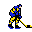
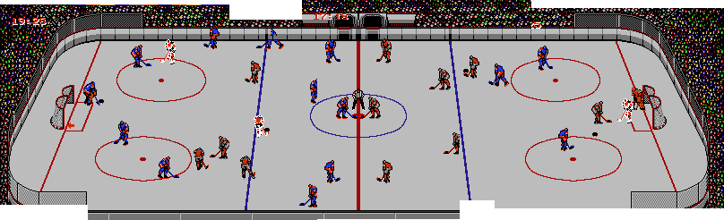
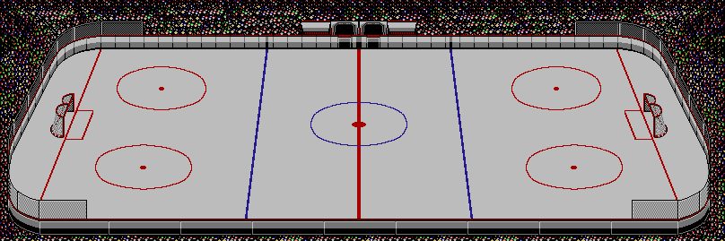

# Brutal-Ice

Brutal Ice will be my *very first (usable) public game.*

Remake of the NES Classic "Blades of Steel" in Pixi.JS with NodeJS/Express/Socket.IO multiplayer engine. Beta will be available soon at <https://ryanfleck.github.io/experiments/brutal-ice>. Read more about why this game is great at <https://arstechnica.com/gaming/2010/11/masterpiece-blades-of-steel/>

Render dimensions have been set to reflect the constraints of the NES: `256 x 240`.

(Looks like web-packed Pixi.JS is **>1.4 mb!** Beware loading on mobile phones.)

To run on local machine:
1. Clone or download repo.
2. `npm i -g http-server`
3. `npm i` (wait) `npm run build`
4. Open a terminal in the project dir and run `http-server`.
4. Browse to `localhost:8080` and the game will run.

Resources:
1. Lots of best practices and initial setup =>  <https://github.com/kittykatattack/learningPixi#settingup>

## Development Notes

In this screenshot of *BOS*, it can be seen that the player sprites are simply y-mirrored and exist facing five directions: up, up-right, right, down-right, down. These, plus stick-up variants and two celebratory poses, means ten sprites to create.

*Image probaby copyright Konami*

The stick takes on the primary player color, and skates secondary.

Step one was getting a background. I stitched a bunch of *BOS* screenshots together to make this:

And then spent a silly amount of time to clean it up and make this, my backdrop:

